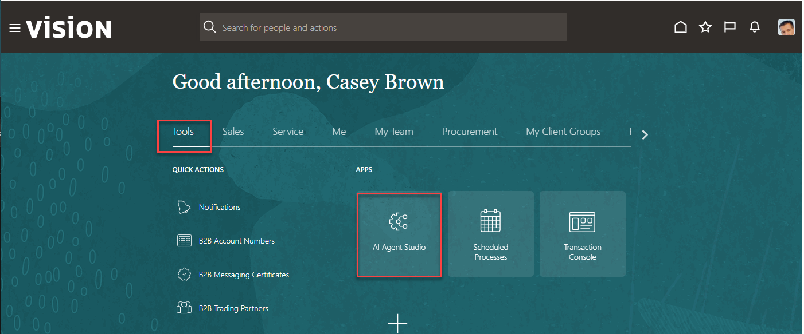
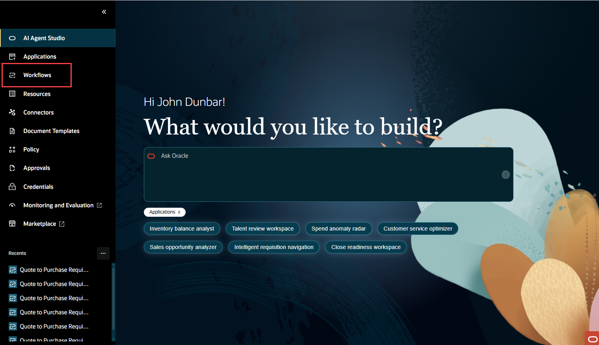
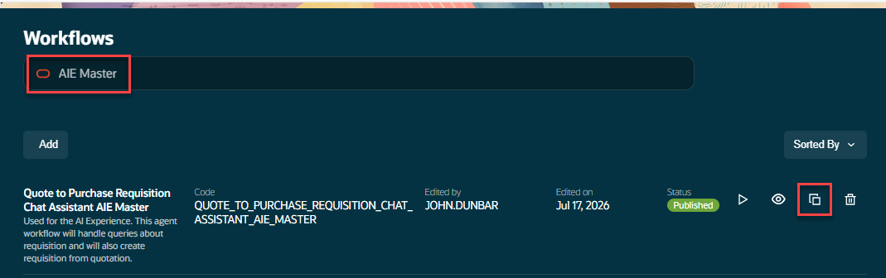
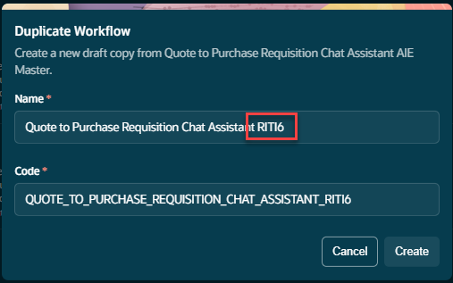

# Exploring a pre-built workflow template

## Introduction

In this lab we will upload a workflow template, save it and get an walkthrough of the template to get an understanding of the various nodes and functionality of the workflow.

Estimated Time: 15 minutes

### Objectives

Understand the structure of a pre-built workflow template and agent tools in AI Agent Studio.

### Usage Notes

   

## Task 1: Login and navigate to the AI Agent Studio Landing Page

1. First you will log in and navigate to AI Agent Studio.

   Login to the lab environment using the credentials provided.  Navigate to the AI Agent Studio tile and click on it. 

2. Go to the **Tools** tab and Click on the tile for **AI Agent Studio**:
3. Click on the AI Agent Studio tile
   

4. On the AI Agent Studio landing page we are going to click on **Workflows**.
   

5. in the search window use **AIE** for the search string.
    Make sure you click on **DUPLICATE**
   

6. Make sure to use ***YOUR INITIAL CODE*** when naming the template. 
   

7. Now that we have our own copy of the workflow we can explore some of the nodes and features. 
   

## Task 2: Examine the Workflow

1. Examine the Get User Session Information Node

   Start by clicking on the **Get User Session Information** then scroll down to the output specification.

    Note that Node **getUserSession** is part of the business object the **Self Detail** business object.
    The getUserSession node copies the Fusion users credentials.  These credentials enforce role-based-access when accessing other Fusion Business Objects ensuring that the user is prevented from accessing information in Fusion they aren't entitled to. 

   
    Close the dialog window by clicking **x** in the upper left hand corner.

2. Examine The Get Intent Node
   The Get Intent Node leverages a LLM to determine the intent of the user's input.  In this workflow it's specifically looking to see if the user want to create a requisition. 

   You can see from the prompt, the users input is used by the LLM to identify what action was requested. 
    
3. Examine The File Processor Node

   The File Processor tool is a tool that can be added to any worker agent. It accepts files passed to it, processes their content, and returns structured output as defined by the agent’s prompt and output schema. No custom setup or duplication required - just add it to your agent.

   

   This completes our examination of a few of the nodes in this workflow.

## Task 3: Download the Example Quotation File

1. Download the Example Quotation File

   This sample quote file will be used when we run our modified workflow.

   Download the sample quotation PDF file: **[CLICK HERE TO DOWNLOAD THE PDF QUOTE FILE](files/aie_quotation_sample.pdf?download=1)** 
    **You have successfully completed Module 1!**

## Summary

You should now have a brief introductory understanding of some the tools and prompts used in this sample workflow. 
In the next lab we will add an additional node to expand the capabilities of this workflow.

[Proceed to the next lab](#next)

## Acknowledgements
* **Author** - 
* **Contributors** - 
* **Last Updated By/Date** - 