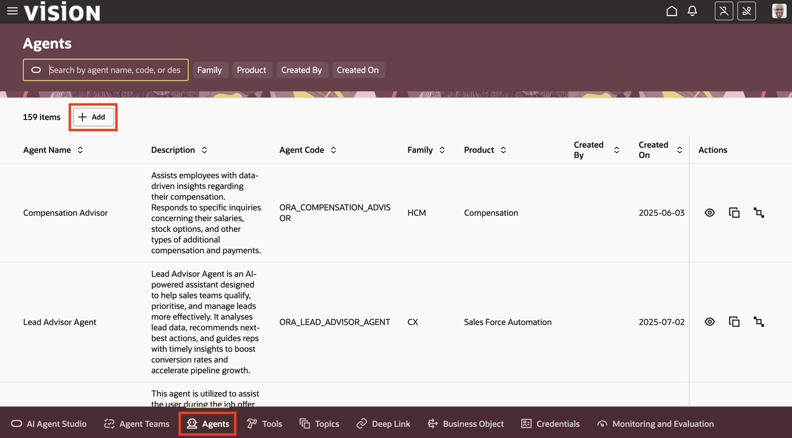
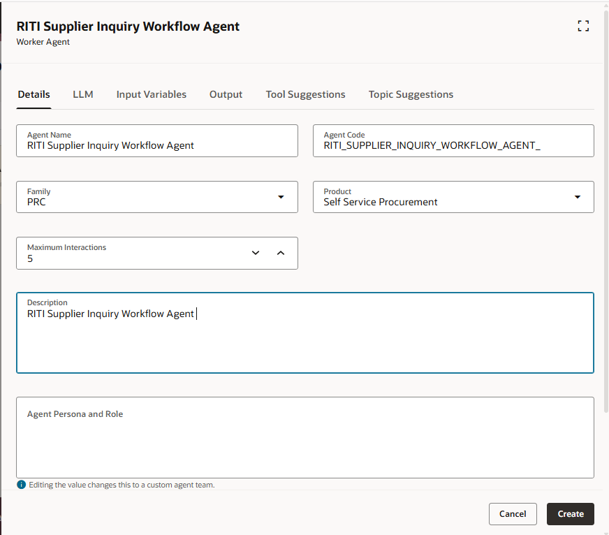
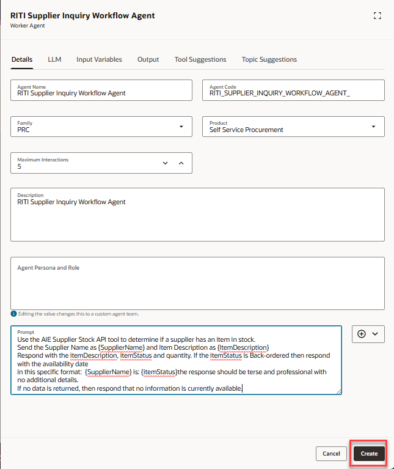
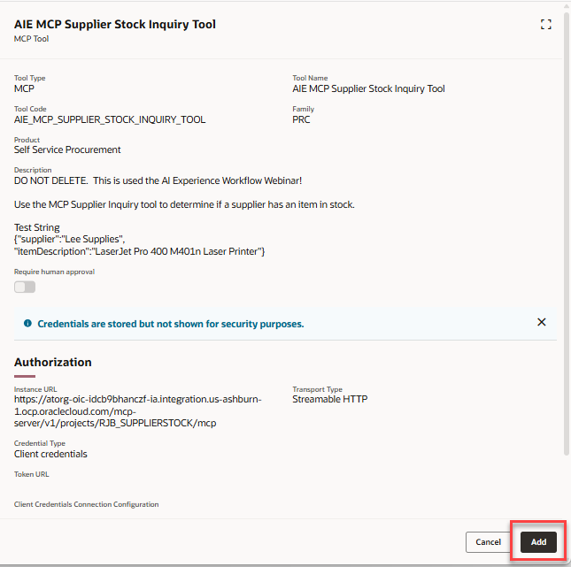
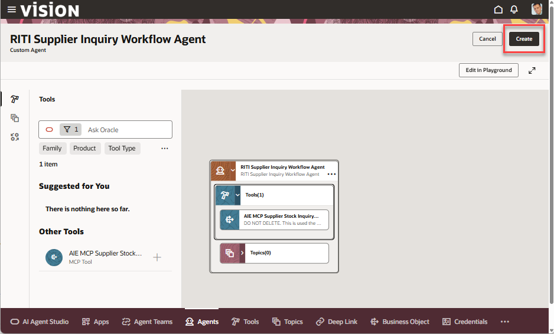
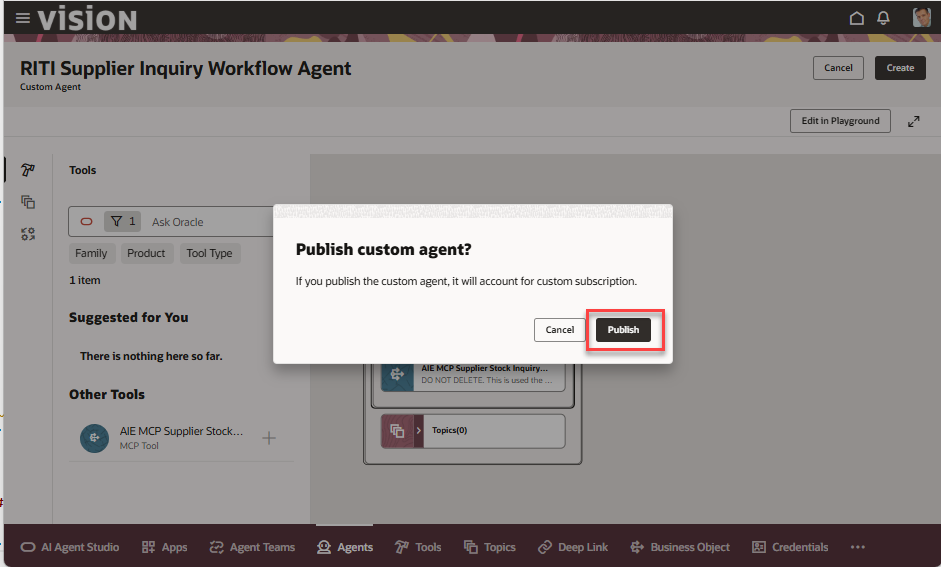

# Building a custom MCP enabled agent

## Introduction

In this lab we will create a new agent that will make an external MCP call to check supplier inventory levels

Estimated Time: 15 minutes

### Objectives

Understand how to build a simple prompt to collect relevant information from an **External MCP tool**

### Usage Notes

   [](include:initial_hints)

## Task 1: Create a new custom agent

1. Create a new custom agent.

   Click on the **Agents** tab, then click on the **Add** button to create a new Supplier Inquiry Workflow Agent:

   

2. Fill in the details as follows with a description of your choice.  Make sure to start the agent name with ***YOUR INITIAL CODE*** and include **Supplier Inquiry Workflow Agent** as the name of the agent.<br/>

   


   Use the value of **5** in the **Maximum Iterations** field.<br/>
   Select the **Family** and **Product** values.
   Provide a **Description**.  You can use the name of the agent or add your own.
   ***DO NOT PRESS CREATE YET.***

   

   Every agent needs a prompt so it can operate.  For this agent the prompt is very simple.  Instructing the agent to uses values that will be available when the agent is part of a supervisor team to retrieve inventory information from a MCP endpoint.

3. Scroll down the to the **Prompt** field, click the **Copy** button below and then paste into the **Prompt** field for the agent.<br/><br/>
   This is a very simple prompt for our exercise, but can be expanded to provide additional instructions to the LLM:

    ```txt
   <copy>
   Use the AIE Supplier Stock API tool to determine if a supplier has an item in stock.
   Send the Supplier Name as {SupplierName} and Item Description as {ItemDescription}
   Respond with the itemDescription, itemStatus and quantity. If the itemStatus is Back-ordered then respond with the availability date
   in this specific format:  {SupplierName} is: {itemStatus}the response should be terse and professional with no additional details.
   If no data is returned, then respond that no information is currently available.
    </copy>
    ```
4. Once you've pasted the text into the **Prompt** field, you can hit the **Create** button:

   **You have successfully completed Task 1!**

## Task 2: Add an MCP tool to the agent

1. Now let's add a tool to our agent.

   Click on the Tools icon  in the left side of the screen.<br/><br/>
2. In the **Ask Oracle** field, enter **AIE MCP** to filter the available Agent Tools<br/><br/>
3. Click on the plus (**+**) symbol to add the AIE MCP Supplier Stock Inquiry Tool to your agent.

   

4. Review the Supplier Stock Inquiry Tool information.  Notice the **Instance URL** listed in the tool:

   

5. Now click on the **Add** button to add this tool to your agent:

   
6. Click on the **Create** button to create your agent.

   
7. Click on the **Publish** button on the Publish Custom Agent popup:

   **Congratulations!** You have created your first AI Agent!  In the next module we'll incorporate it into our workflow.

   **You have successfully completed Module 2!**

## Summary

You should now have an understanding of creating a simple AI Agent, what it does, and how to develop a prompt to successfully pass data back and forth with it.

**You have successfully completed Lab 2!**

[Proceed to the next lab](#next)

## Acknowledgements
* **Author** - [](var:author)
* **Contributors** - [](var:contributors)
* **Last Updated By/Date** - [](var:last_updated)
