# Updating the workflow with additional Nodes

## Introduction

We will add a new node to our workflow and updated other nodes to add new functionality to the agent.  We will walk through how to create a new node, add a tool and how to navigate the variables option to find the values we need.

The new node we will be adding will allow the workflow to access product availability information about the line items in the invoice.  This includes availability, number of items in stock as well as availability date is the item is unavailable.  This information can be used by the person accessing the workflow to make decisions about creating the invoice.

This will be done by adding a REST node to access this information.  The results of this call will be included in the summarization step in the workflow.  We will update that step with the additional information returned from this new node.

Estimated Time: 20 minutes

### Objectives

How to add a node to the workflow.

Become familiar with the tools & menu options provided during this process.

## Task 1: Locate the Summarize the Requisition Node

1. We need to located the **Summarization the Requisition** node in the workflow.  Our new REST node will be added before it.  Rather than scrolling through the workflow to find the node will will locate it via the menu.</br>

   **Right Click** anywhere in the workspace except on a node.  Use the menu to find the step we are looking for.</br>

   Select **Locate Node**.  Under the **AI** nodes, look for the **Summarize the Requisition** Node.

   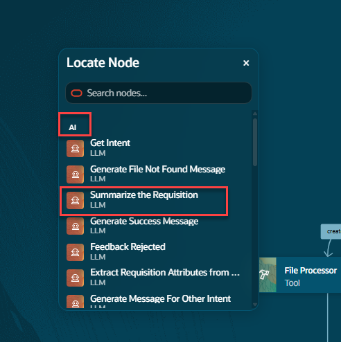
2. Now that we are at the part of the workflow where we want to add a new node, right click again and select **Add Node**.
   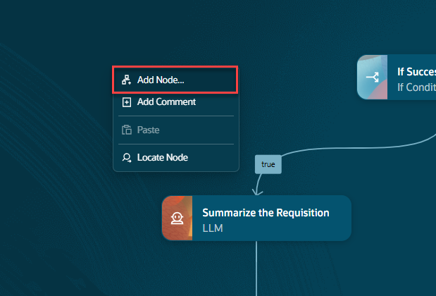

3. From the node types, scroll down to **External REST**.
   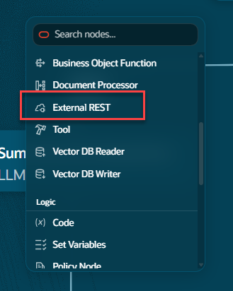

## Task 2:  Configure the External REST Node
1. The external REST endpoint we are calling will be used to see if the items in the line items of the invoice are in stock.  Inventory information will be returned for each line item.

   Once the configuration dialog is open we can fill in the necessary values.
2. Use **Check Inventory** for the Name field.  It's important that it's spelled correctly.  It's referenced in the LLM prompt in the next step.</br>
   ```txt
   <copy>
   Check Inventory
   </copy>
 ```
3. Fill in the fields</br>
   For **Description** provide a description for the node.  You can use the name of the node for the lab or provide a more descriptive value.</br>
   For Family choose **PRC**.</br>
   For product choose **Self Service Procurement**.</br>
   For the Tool choose **AIE Supplier** this is the predefined REST tool that will perform the inventory information check.</br>
   Once you select the  REST tool you need to select what function in the tool to call.
   In this case there is only a single function.  Choose **get_inventory**.</br>
   Once the tool is selected the required parameters will be displayed.</br>
   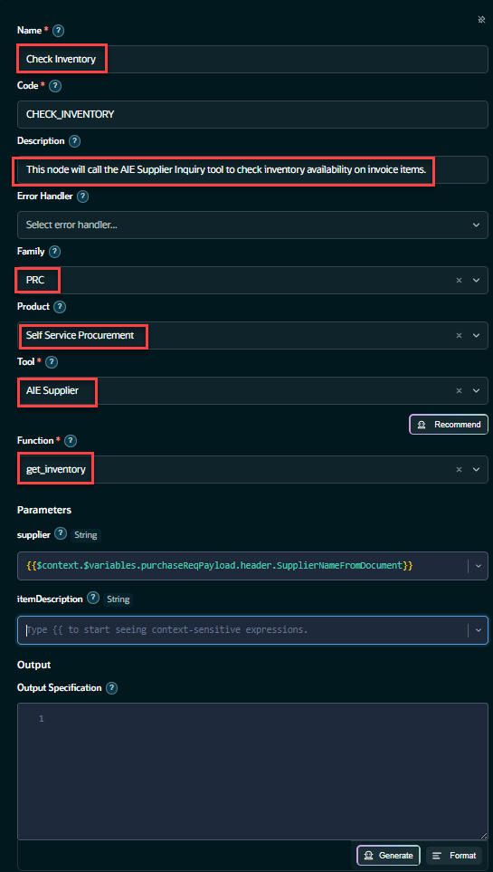

4. Fill in the parameter fields</br>
   We will be using the **purchaseReqPayload** variable to pull the data from.</br>
   Locate the **supplier** variable for the rest input.
   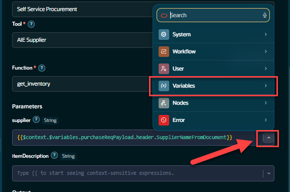
5. Under the Parameters section Next to the **supplier Field** text box, click on the **Down Arrow**.  This will open a new dialog box where we will search for the input value for this variable.
6. From here select **purchaseReqPayload**.
   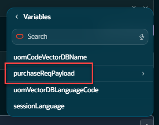
7. Select **header** then select **SupplierNameFromDocument**
   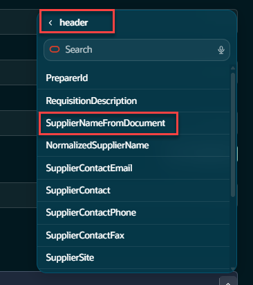
8. Once selected you should see the value in the field, the supplier value should look like the image below.
   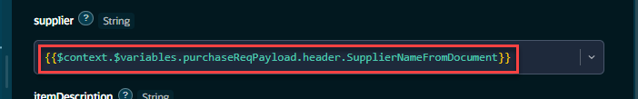
9. If you are having trouble navigating the menu you can copy this string into the **supplier** field.
   ```txt
   <copy>
   {{$context.$variables.purchaseReqPayload.header.SupplierNameFromDocument}}
   </copy>
   ```
10. Set the **itemDescription** field</br> 
   This will be similar to setting the supplier name.
   **itemDescription** This is the description of a line item provided in the invoice. The workflow will obtain these values from the PDF file that will be uploaded when we run the agent.

11. Under the Parameters section Next to the **itemDescription** text box, click on the **Down Arrow**.  This will open a new dialog box where we will search for the input value for this variable.
   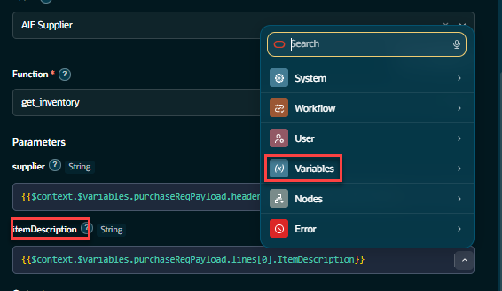
12. From there select **purchaseReqPayload**.
   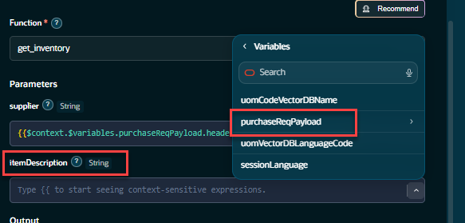
13. Select **lines** then select **items(0)**
   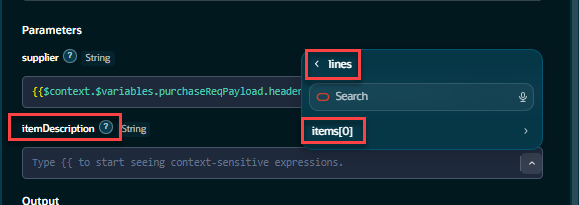
14. Once selected you should see **itemDescription** field
   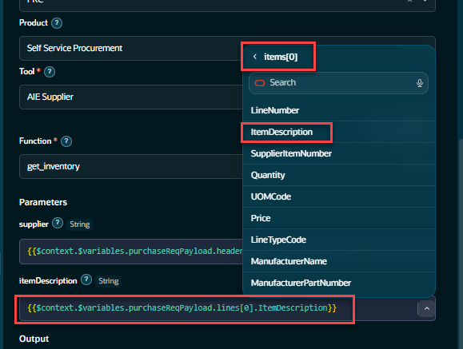
15. Once selected you should this string in the **itemDescription** field.
   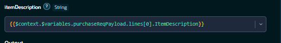
16. If you are having trouble navigating the menu you can copy this string into the supplier field.
   ```txt
   <copy>
   {{$context.$variables.purchaseReqPayload.lines[0].ItemDescription}}
   </copy>
   ```

17. **Set the Output Values of the Node**</br>
   The last step is to set the output values.  This will be the output of our REST node and the value will be used in the **Summarize the Requisition Step**

   ```txt
   <copy>
   item, itemStatus, stockOnHand, availabilityDate
   </copy>
   ```
18. Click on the **Generate** button to enable the input field
   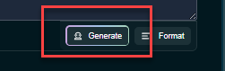
   Copy these values above and paste them into the input field on the **Output Specification** window.</br>
   Once, pasted, the green **GO** button will be enabled.
   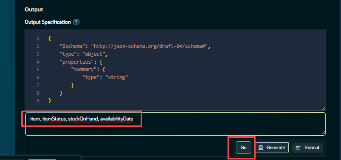
      The output schema will be created for the output based on the values you provided.  The configuration for this node is complete.</br>
      The **Output Specification** field should look like the image below.
   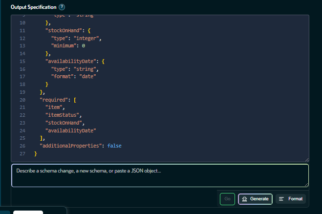
   The output schema will be created for the output based on the values you provided.  The configuration for this node is complete.</br>
19. If you had trouble generating the schema, you can copy the text below and paste it into the Output Specification window.

   ```txt
   <copy>
   {
   "$schema": "http://json-schema.org/draft-07/schema#",
   "type": "object",
   "properties": {
      "item": {
         "type": "string"
      },
      "itemStatus": {
         "type": "string"
      },
      "stockOnHand": {
         "type": "integer",
         "minimum": 0
      },
      "availabilityDate": {
         "type": "string",
         "format": "date"
      }
   },
   "required": [
      "item",
      "itemStatus",
      "stockOnHand",
      "availabilityDate"
   ],
   "additionalProperties": false
   }
   </copy>
   ```

   Close the node by pressing the **x** in the upper right hand corner.
   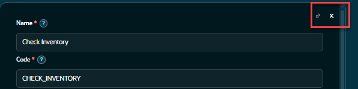

   **Congratulations!**  You have successfully completed Lab 2.

## Summary
   You now have an understanding of how to create a REST node in a workflow<br/>

## Acknowledgements
* **Author** - [](var:author)
* **Contributors** - [](var:contributors)
* **Last Updated By/Date** - [](var:last_updated)