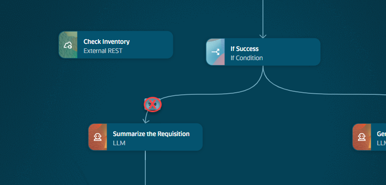
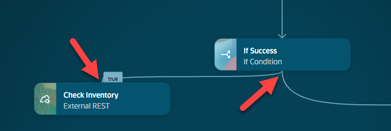
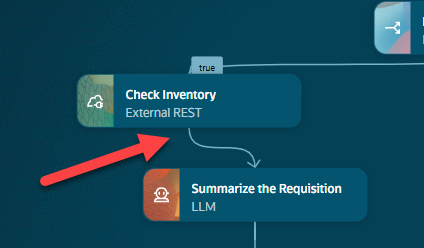
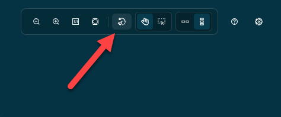
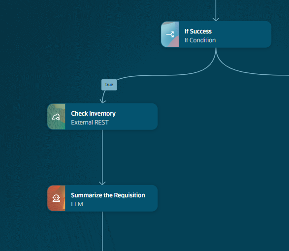
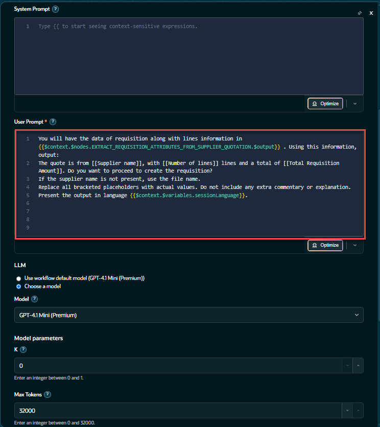
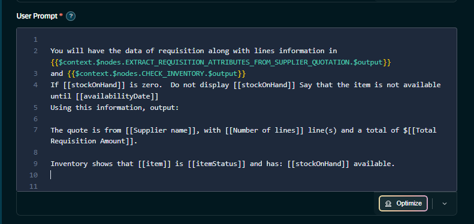

# Updating the workflow with additional Nodes

## Introduction

Now you have created the new REST node, we need to connect it into the workflow.  Once that is complete we will examine the Summarize the Requisition node and modify it's prompt to include the inventory information obtained from the REST node we created.

We will add a new node to our workflow and updated other nodes to add new functionality to the agent.  We will walk through how to create a new node, add a tool and how to navigate the variables option to find the values we need.

Estimated Time: 10 minutes

### Objectives

How to connect nodes in a workflow.  Examine what a LLM node looks like.

### Usage Notes

## Task 1: Connect the REST Node to the Workflow


   1. Click on the **true** image on the line that connects the **If Success** node to the **Summarize the Requisition** Node.  It will turn into a circle with a red X.  Click on the X to delete the connecting line.
   

   2. Drag a line from the center of the **If Success** node and drag it to the center of the **Check Inventor** Node.
   

   3. Drag a line from the center of the **Check Inventory** node and drag it to the center of the **Summarize the Requisition** Node. Make sure you are connecting the **true** path.
   

   4. In the upper left hand corner of the workflow in the menu, select **Prettify** button to clean up the added node.
   

   5. You will have to go back to this section of the workflow.  Right click in thw workflow, Select **Locate Node** and select **Summarize the Requisition** to return to the node.
   
   

## Task 2 Update the Summarize the Requisition Step with the Updated Prompt

1. Navigate to the **Summarize the Requisition*** step.  Click on the anywhere on the node to open the menu.  Click on **Edit**.<br/>

   


2. Click **Copy** in the box below to copy the new prompt.
   ```txt
   <copy>
   You will have the data of requisition along with lines information in {{$context.$nodes.EXTRACT_REQUISITION_ATTRIBUTES_FROM_SUPPLIER_QUOTATION.$output}}
   and {{$context.$nodes.CHECK_INVENTORY.$output}}
   If [[stockOnHand]] is zero.  Do not display [[stockOnHand]] Say that the item is not available until [[availabilityDate]]
   Using this information, output:
   The quote is from [[Supplier name]], with [[Number of lines]] line(s) and a total of $[[Total Requisition Amount]].

   Inventory shows that [[item]] is [[itemStatus]] and has: [[stockOnHand]] available.
   Present the output in language {{$context.$variables.sessionLanguage}}.
   </copy>
    ```

3. Update the existing prompt.</br> Delete the old prompt and copy this new prompt and paste it into the text field.<br/>
   You  will notice that the output from our new node has been included in the new prompt. **{{$context.$nodes.CHECK_INVENTORY.$output}}**
   

4. Close the dialog box.

   **Congratulations!**  You have successfully completed Lab 4.

## Summary
   You now have an understanding of how to extend a workflow template by adding a new node and updating an existing one.<br/>

## Acknowledgements
* **Author** - [](var:author)
* **Contributors** - [](var:contributors)
* **Last Updated By/Date** - [](var:last_updated)