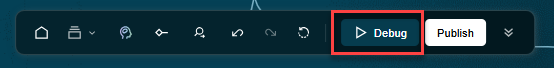
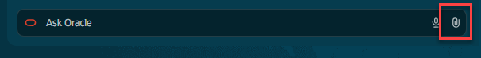
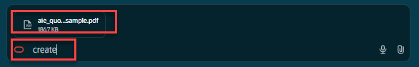
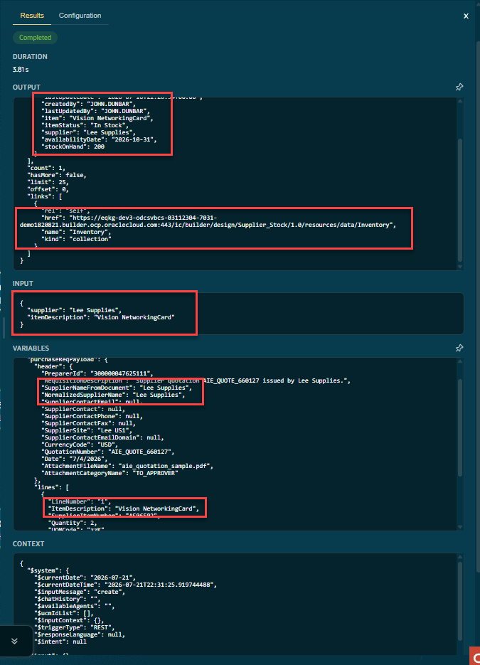
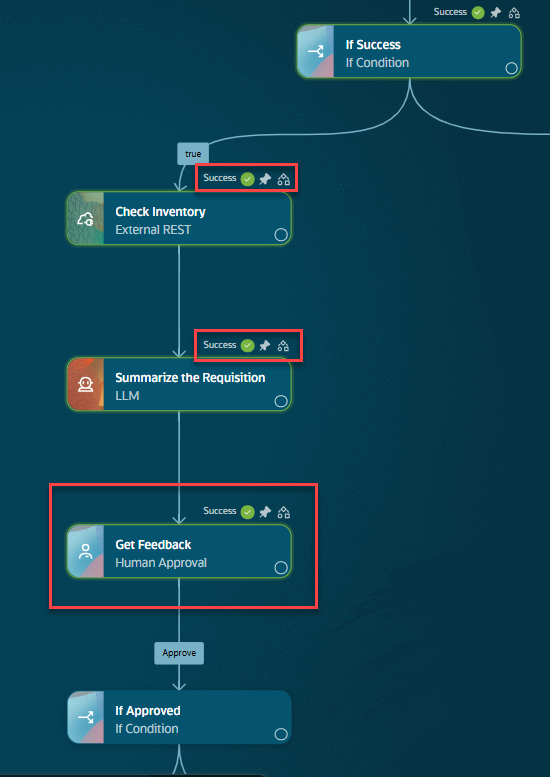
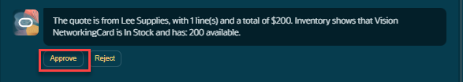
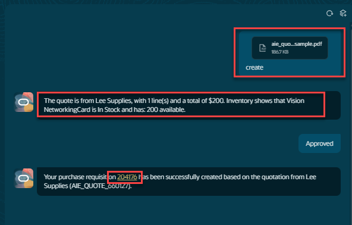
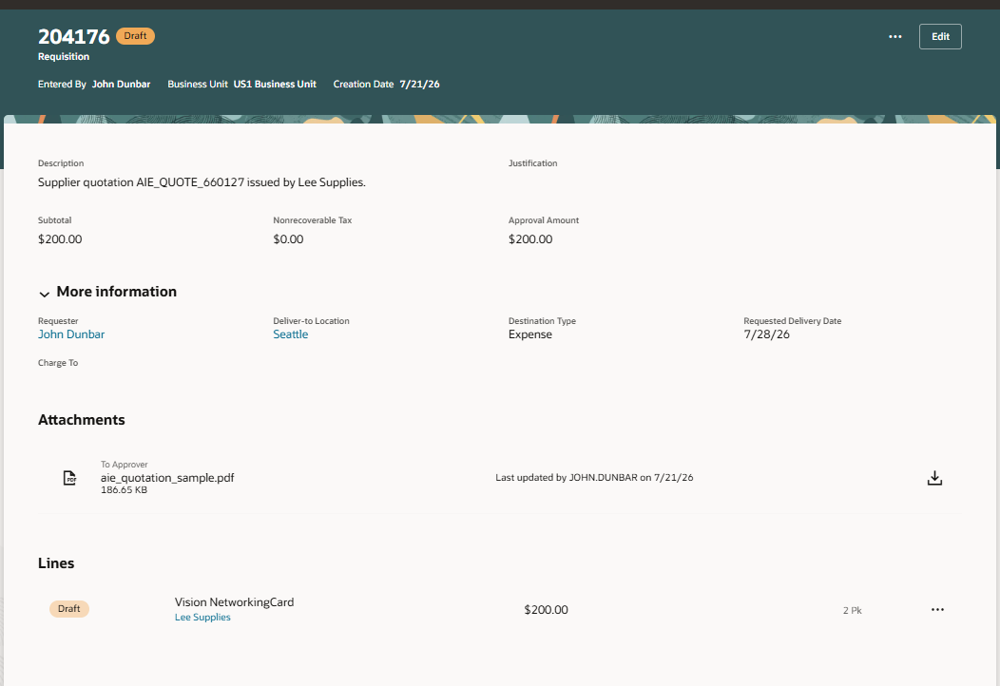

# See the Workflow in Action

## Introduction

Now that we have a completed workflow agent; you will run the agent, examine the output and get an introduction to the debugging tool in AI Agent Studio.

Estimated Time: 10 minutes

### Objectives

Understand how to run a workflow in the debugger. 
Examine the debugger output and how to drill into a step for more details.

## Task 1: Run the workflow

   
   1. We will now run the agent in the debugger.  Click on the **debug** button to get things started.  
   
   2. Upload the .PDF file we downloaded in Lab1.  Click on the **paperclip** icon to upload the file. .
   
   3. Once uploaded, type **create** and press return.
   
   4. Scroll down to the REST node we added.  Click on the node to see the debug output.  You can see the data from the **purchaseRequisitionObject** that we leverage as input for the node. 
   You can also see the input to the REST call and the information the REST call returned with the inventory status.
   
   5. The Get Feedback node is a human in the loop node.  The workflow prompts the user to continue before creating the requisition. 
   
   6. Click Approve to create the requisition.
   
   6. When the workflow completes, you will see a hyper-link to the new requisition.
   **Click** on the hyper-link to see your newly created requisition.
   

   **Congratulations!**  You have successfully created and tested your workflow! 
   **You have successfully completed the Lab!**
## Summary
   You now have an understanding of how to:  
   Copy a existing workflow. 
   Create a new node that uses REST tool. 
   Update a existing LLM node to add our new functionallity to it. 
   Understand how to navigate in AI Agent Studio to accomplish the above tasks  

## Acknowledgements
* **Author** - 
* **Contributors** - 
* **Last Updated By/Date** - 