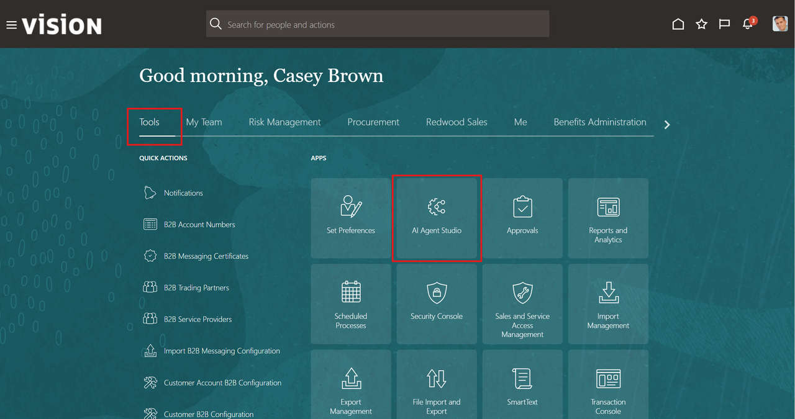
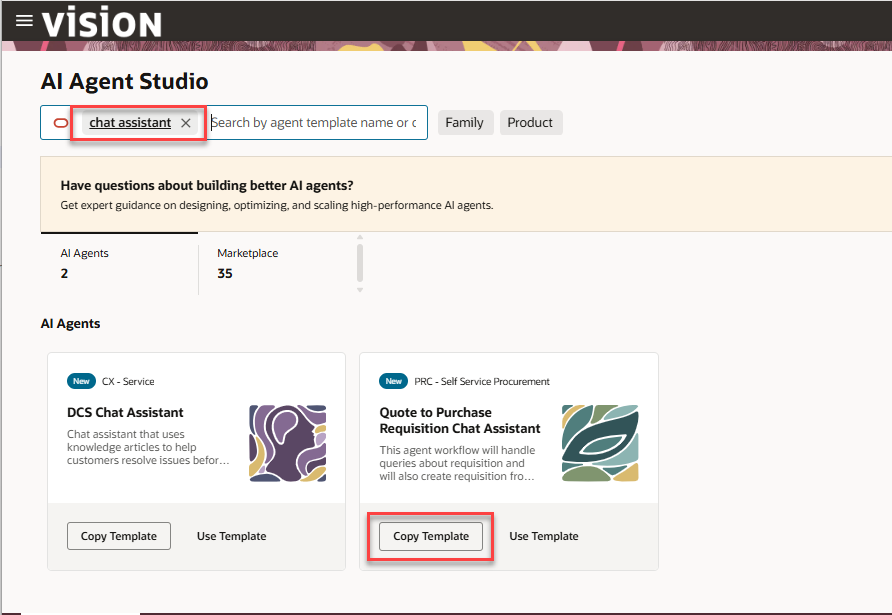
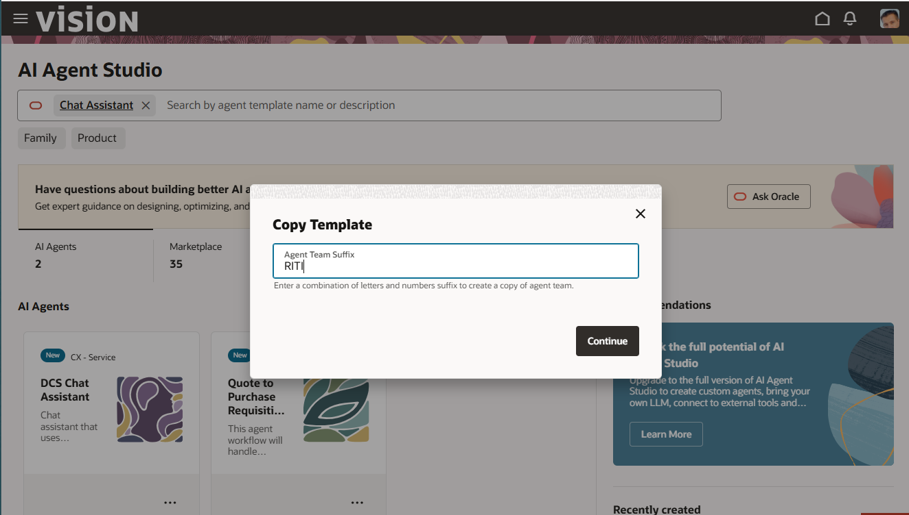
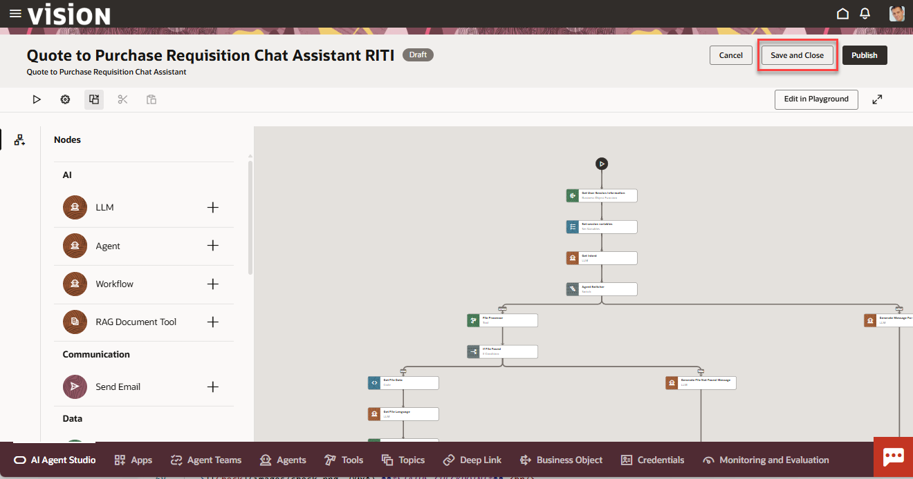
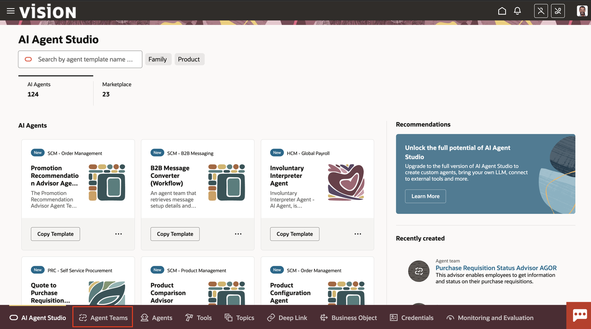
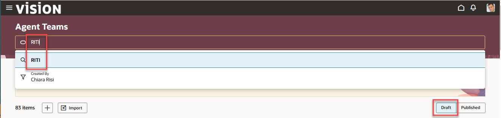
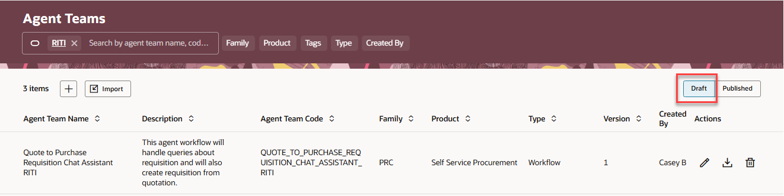
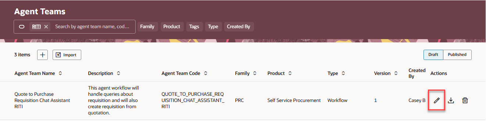
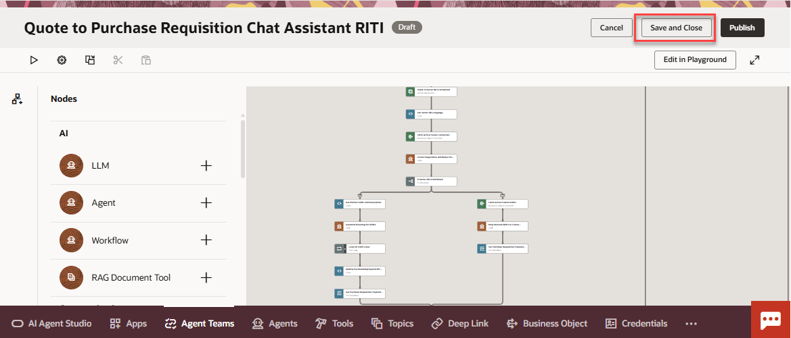

# Exploring a pre-built workflow template

## Introduction

In this lab we will copy an existing workflow template and get an understanding of the various components  that instruct the large language model (LLM) how to execute the workflow.

Estimated Time: 15 minutes

### Objectives

Understand the structure of a pre-built workflow template and agent tools in AI Agent Studio.

### Usage Notes

   

## Task 1: Locate and copy the pre-existing Quote to Purchase Requisition Chat Assistant workflow template

1. First you will log in and navigate to AI Agent Studio.

   Login to the lab environment using the credentials provided. Make sure to use your assigned user. 

2. Next you will locate and copy the Purchase Requisition Status Advisor agent template.

3. Go to the **Tools** tab and Click on the tile for **AI Agent Studio**:

   

4. Search for **Chat Assistant** in the search box:

   

5. Click on **Copy Template** for the Purchase Requisition Status Advisor. 

   If you do not see **Copy Template**, click on the 3 dots in the bottom right corner of the Quote to Purchase Requisition Status Advisor box. 

   >  ***IMPORTANT!***  
   > ***DO NOT CLICK*** on **Use Template** 
   > **DO CLICK** on **Copy Template**.

6. In the Agent Team Suffix box, enter ***YOUR INITIAL CODE***. 

   Click on the **Continue** button. 
   If you get a message that a component with that name already exists, make sure you are using a unique code.  Add a number if required.  Just be sure to use that code throughout the rest of the lab.

   

7. Next you will save your agent team copy and ensure that you can locate it.

   Click the **Save and Close** button in the top right of the screen:

   

8. On the tab bar on the bottom of the screen, Click on **Agent Teams**:

   

9. Enter ***YOUR INITIAL CODE*** in the search box and hit **ENTER**:

   

10. Select the **DRAFT** button (your agent team will be in draft status).  You should see your newly-created agent team:

   

   > ***STATUS CHECKPOINT***  
   > If you do not see your workflow, return to step 2 [above](#task1locateandcopythepreexistingpurchaserequisitionstatusadvisoragent)

   **You have successfully completed Task 1!**

## Task 2: Examine the pre-built Quote to Purchase Requisition Chat Assistant template components

1. Open your copy of the Quote to Purchase Requisition Chat Advisor template.

   Click on the pencil icon to open your newly created agent team:

   

2. Let's take a closer look at the components of the Quote to Purchase Requisition Status Advisor Agent Team template.

3. Click on the **Gear** button in the upper left hand corner of the screen.
- **LLM**: This Agent Team has the default LLM set.
- **Chat Experience**: It has enabled Enable File Upload in Chat Experience so that documents can be uploaded.
- **Variables**: It has four variable defined.

4. Examine a node

Now let’s review one of the nodes of this agent. Open the **Get User Session Information** node to review its setup.

Note that function **getUserSession** under business object **Self Detail** is set to be used in this node.
Optionally, you can navigate to the **Business Object** tab at the bottom of the page and query up this Business Object to see it’s setup in more detail.

5. Continue to examine a node

Scroll further down the page and note that the JSON specification has been entered. The results of the business object will
be returned in this format, and the use of the JSON specification means that the attributes can be referred to directly in
subsequent nodes.

6. Examine Other Nodes

Feel free to review other types of nodes in this workflow When done, proceed to the next step where we will creating and adding a new agent to the workflow.

Click on **Save and Close** button saving your copy of the Purchase Requisition Chat Assistant:

   

   **You have successfully completed Module 1!**

   
## Summary

You should now have a introductory understanding of the tools and prompts provided by the pre-built Quote to Purchase Requisition Status Advisor workflow template. 
In the next lab we will create a custom agent to expand the capabilities of this workflow.

[Proceed to the next lab](#next)

## Acknowledgements
* **Author** - 
* **Contributors** - 
* **Last Updated By/Date** - 