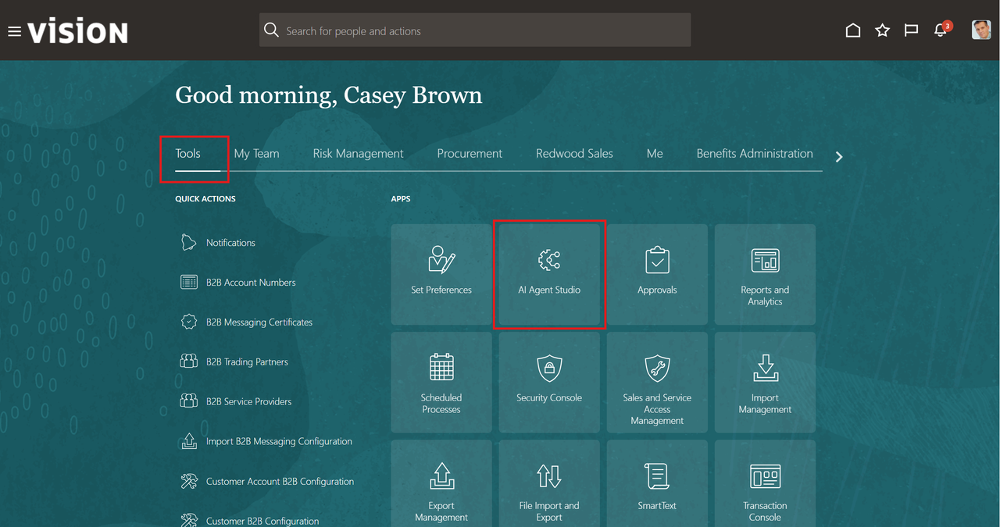
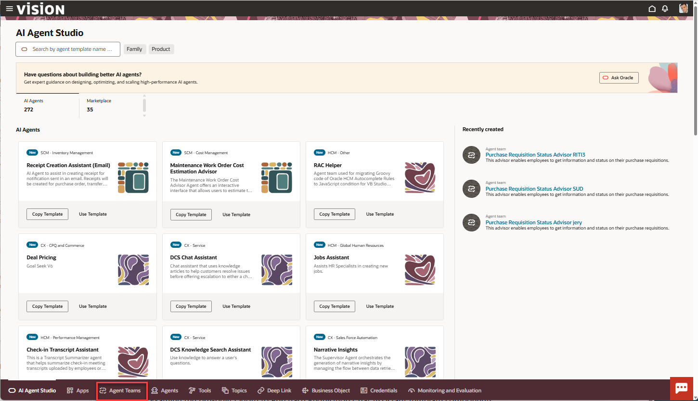
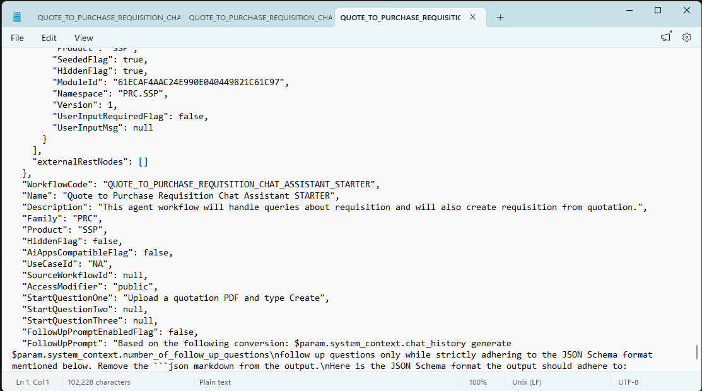
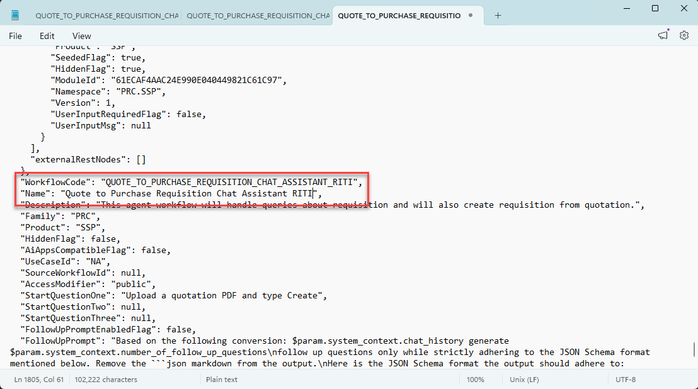
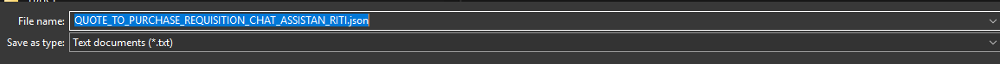
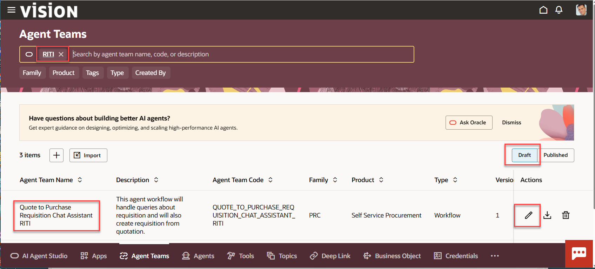
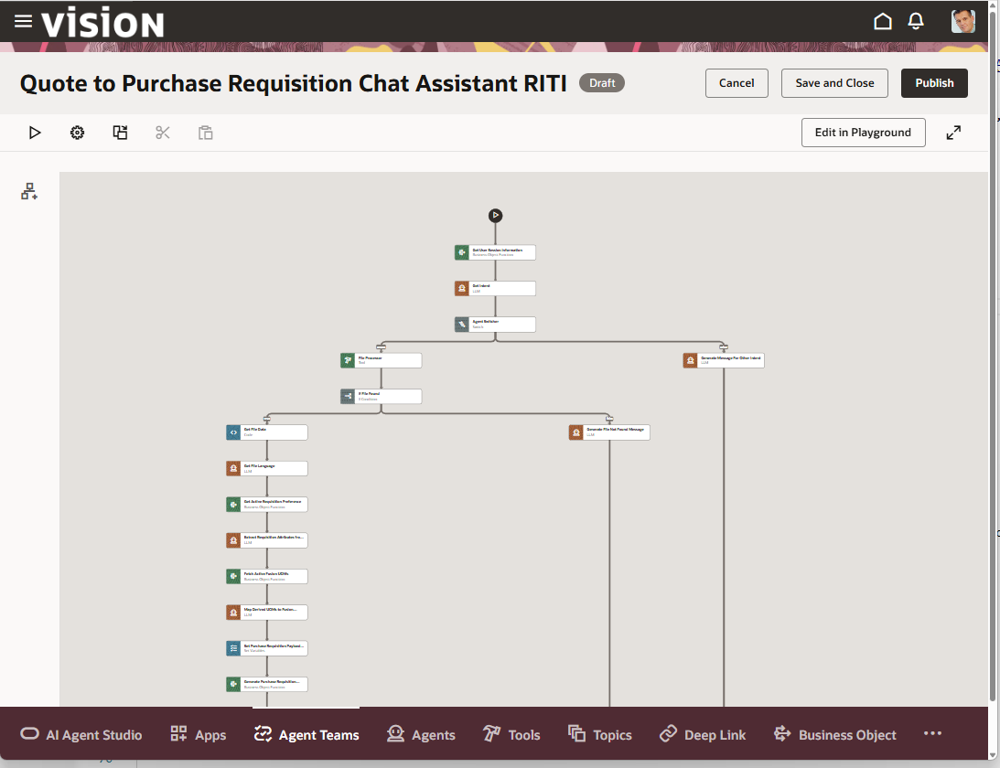
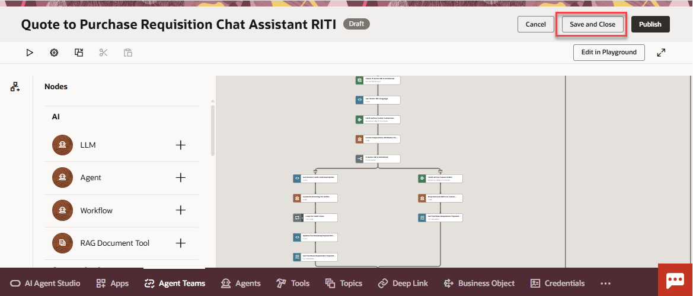

# Exploring a pre-built workflow template

## Introduction

In this lab we will upload a workflow template, save it and get an walkthrough of the template to get an understanding of the various nodes and functionality of the workflow.

Estimated Time: 15 minutes

### Objectives

Understand the structure of a pre-built workflow template and agent tools in AI Agent Studio.

### Usage Notes

   

## Task 1: Login and navigate to the AI Agent Studio Landing Page

1. First you will log in and navigate to AI Agent Studio.

   Login to the lab environment using the credentials provided.  Navigate to the AI Agent Studio tile and click on it. 

2. Go to the **Tools** tab and Click on the tile for **AI Agent Studio**:

   
3. Clicking on the AI Agent Studio tile will take you to the AI Agent Studio landing page.

On the landing page you can explore all of the pre-built templates as well as the marketplace templates available to use.
    

Next we will move to the **Agent Teams** window. The Agent Teams tab is located at the bottom of the page. 
Click on Agent Teams at the bottom of the page. 

   

## Task 2: Download Sample PDF Quote File
We will download the example quotation that we will use when we run the workflow.  Click on the download text and save the quotation. 

1. Download the sample quotation PDF file: **[CLICK HERE TO DOWNLOAD THE PDF QUOTE FILE](files/aie_quotation_sample.pdf?download=1)**

## Task 3: Download and Edit the Workflow .JSON File
1. Download the sample workflow file: **[CLICK HERE TO DOWNLOAD WORKFLOW FILE](files/QUOTE_TO_PURCHASE_REQUISITION_CHAT_ASSISTANT_STARTER.json?download=1)**

2. Open the .json file with an editor: Notepad, Visual Studio, textpad, etc.  **DO NOT USE Microsoft Word!**

3. Scroll to the bottom of the file.

   
4. On the line beginning with "WorkflowCode:" Replace **_STARTER** with a underbar and your initials in UPPERCASE  
5. On the next line beginning with "Name":" Replace **STARTER** with your initials in **UPPERCASE**  
   

6. Once complete.  You will need to *SAVE AS* of the file with the new name. 

   

     ***IMPORTANT!***  
   **Verify that you have made the two changes to the file with your initials** 
   **Verify you have re-named the file with an underbar and your initials in UPPERCASE**.

## Task 4: Import the file into AI Agent Studio

1. On the Agent Teams page, click on the Import button.  Upload your updated workflow. 
   

2. Once you complete the import you will search for your imported workflow agent. 
Verify that the **Draft** button is selected then type in the initials you used to update the import file in the search box. 
Click on the pencil icon to open the workflow.
   

   In the next task we will examine the agent.

   

   > ***STATUS CHECKPOINT***  
   > If you do not see your workflow, return to step 2

   **You have successfully completed Task 3!**

## Task 5: Examine the some of the components in the workflow

1. Let's take a closer look at the Get User Session Step

Now let’s review one of the nodes of this agent. Open the **Get User Session Information** node to review the node.

Note that function **getUserSession** is part of the business object **Self Detail** business object.
The getUserSession node copies the Fusion users credentials.  These credentials enforce role-based-access when accessing other Fusion Business Objects ensuring that the user is prevented from accessing information in Fusion they aren't entitled to.

2. Continue to examine the getUserSession node

Scroll further down the page and note that the JSON specification has been entered. The results of the business object will
be returned in this format, and the use of the JSON specification means that the attributes can be referred to directly in
subsequent nodes. 
Press cancel when done examining the node.

 

5. Examine The LLM Node
The LLM Node leverages a LLM to determine the intent of the user's input.  In this workflow it's specifically looking to see if the user want to create a requisition. 

You can see from the prompt, the users input is used by the LLM to identify what action was requested. 

5. Examine The File Processor Node

The File Processor tool is a tool that can be added to any worker agent. It accepts files passed to it, processes their content, and returns structured output as defined by the agent’s prompt and output schema. No custom setup or duplication required — just add it to your agent.

Configuration of this tool is straight forward. 

This completes our examination of a few of the nodes in this workflow. 

Click on **Save and Close** button saving your copy of the Purchase Requisition Chat Assistant:

   

   **You have successfully completed Module 1!**

   
## Summary

You should now have a brief introductory understanding of some the tools and prompts used in this sample workflow. 
In the next lab we will create a custom agent to expand the capabilities of this workflow.

[Proceed to the next lab](#next)

## Acknowledgements
* **Author** - 
* **Contributors** - 
* **Last Updated By/Date** - 