# Putting it all together - Updating the workflow with the new custom agent

## Introduction

Now that you've built a new custom agent in the last lab, we will add the agent to our copy of the **Quote to Purchase Requisition Chat Assistant** template.
Finally we'll test the completed workflow to understand what debugging capabilities are provided during the development process.

Estimated Time: 15 minutes

### Objectives

How to add a node to a workflow and update an existing node.

Become familiar with the debugging tools provided during the development process.

### Usage Notes

   [](include:initial_hints)

## Task 1: Download Excel File 
1. Download the sample quotation excel file **[HERE](files/quotation_riti.xlsx?download=1)**

Before we run the agent, let’s prepare a purchase order PDF file needed to execute this agent.
Download the quotation.xls shared with this exercise. Modify the Quotation Number value to replace **RITI** with your
initials and save it as a PDF.
E.g., If your name is: **“Sheldon Cooper”**, quotation number will be: **SHCO_QUOTE6_260127**.

Save the excel file as a **PDF**.

   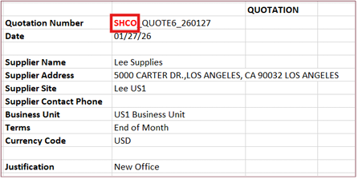

## Task 2: Add our Custom Agent to the workflow

1. First we will open our workflow for editing.

   Click on **Agent Teams** tab.<br/>
2. Select the **Draft** button.<br/>
3. Enter ***YOUR INITIAL CODE*** in the search box.<br/>
4. Select the pencil icon to edit your workflow:

   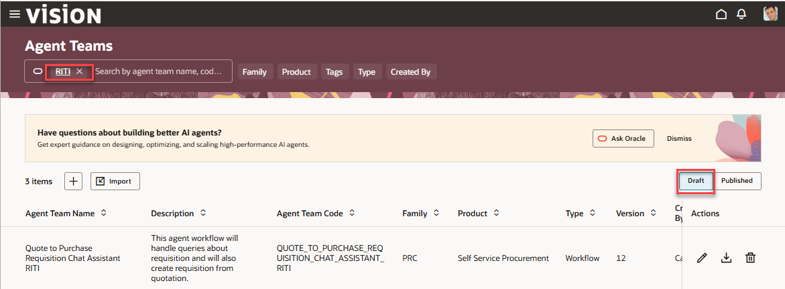

5. Next we will add our custom agent to the workflow.<br/><br/>
   Navagate  to the **Summarize the Requisition** LLM step. We will be adding our agent above this step.
   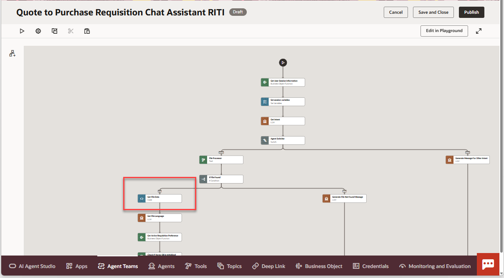

6. Click on the **plus sign** just above the step to add a new step to the workflow.

   Click on **AI** then **Agent** in the menu.
   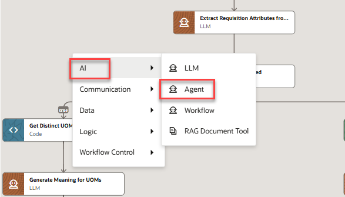</br>
   
   Provide the following information in the dialog box.</br></br>
   **Important**  Make sure to use **SupplierInquiryRestCall** as the name of the step.  This will match the text in the updated prompt in the LLM step.</br></br>
   Provide the rest of the information.</br>
   Search for the agent you created in the previous lab and select it.
   
   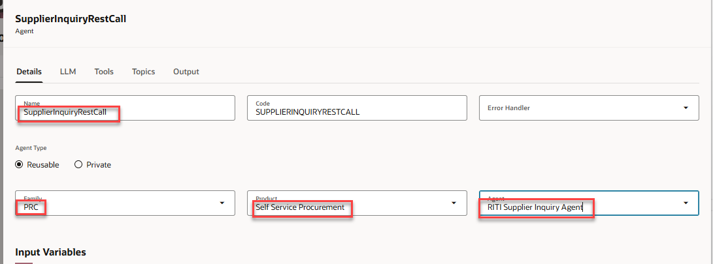

   Now we will add the input variable. Click on the **pencil** icon to open up the menu.</br>

   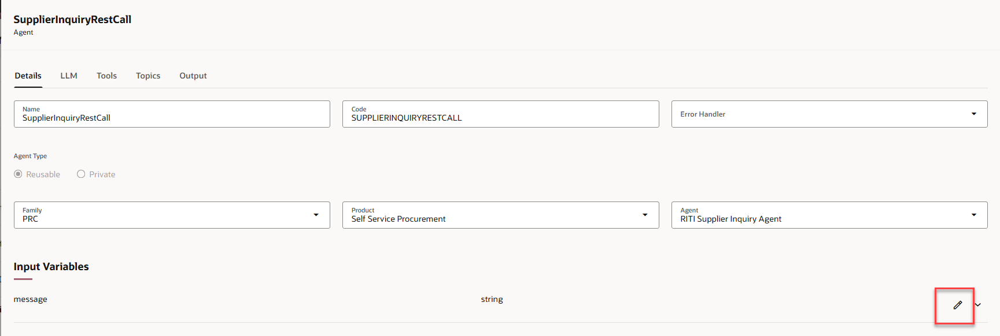
   Click on the **plus down arrow** to open up the menu.</br>
   From **Context** select **Variables** then **purchaseReqPayload**</br>
   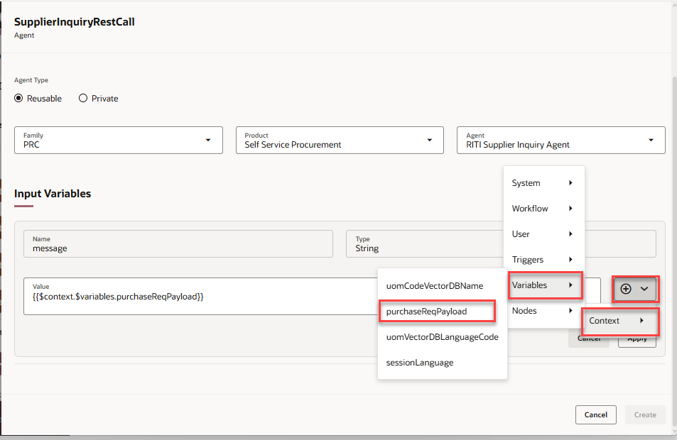
   This variable contains the information collected from the purchase order.</br>

      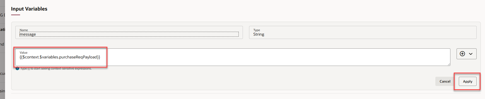
   Click on **Apply** when finished.
   Verify that you have the correct name for the step, the correct agent and the correct variable.  Click **Create** when done.
      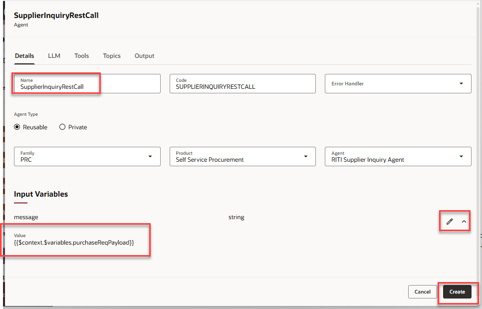
## Task 3: Updating the LLM Step

1. Navigate to the **Summarize the Requisition*** step.  Click on the lower right hand corner to open the menu.  Click on **Edit**.<br/>

   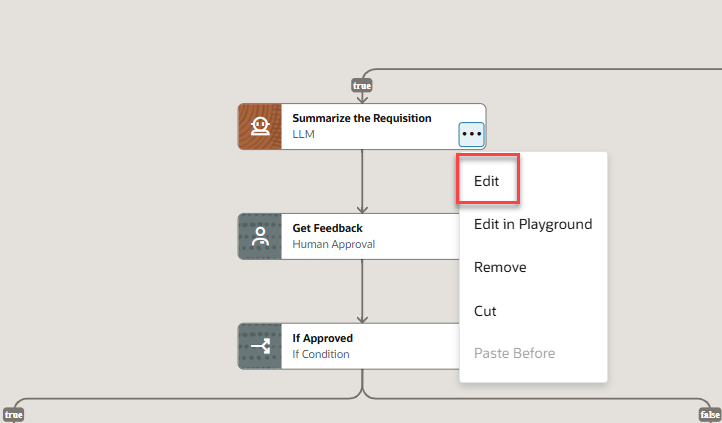


   Click **Copy** in the box below to copy the new prompt.

   ```txt
   <copy>
You will have the data of requisition along with lines information in {{$context.$nodes.EXTRACT_REQUISITION_ATTRIBUTES_FROM_SUPPLIER_QUOTATION.$output}} . Using this information, output:
The quote is from [[Supplier name]], with [[Number of lines]] lines and a total of $[[Total Requisition Amount]]. I checked the supplier inventory.  {{$context.$nodes.SUPPLIERINQUIRYRESTCALL.$output}}.  Do you want to proceed to create the requisition? 
If the supplier name is not present, use the file name.
Replace all bracketed placeholders with actual values. Do not include any extra commentary or explanation.
Present the output in language {{$context.$variables.sessionLanguage}}.
   </copy>
   ```
2. Update the existing prompt.</br> Delete the old prompt and copy this new prompt and paste it into the text field.
   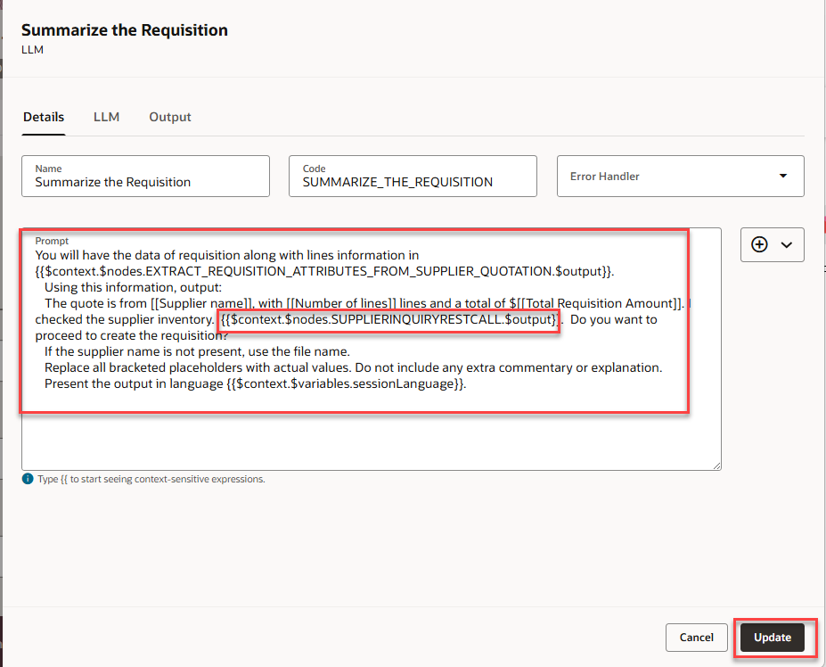


   Click **Update** when complete.

   **Congratulations!**  You have successfully completed Lab 2 

## Summary
   You now have an understanding of how to extend a pre-defined workflow template.<br/>

## Acknowledgements
* **Author** - [](var:author)
* **Contributors** - [](var:contributors)
* **Last Updated By/Date** - [](var:last_updated)