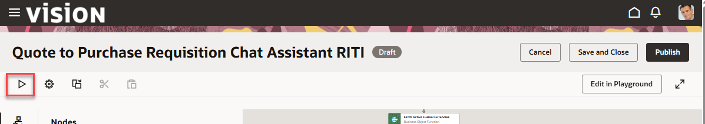
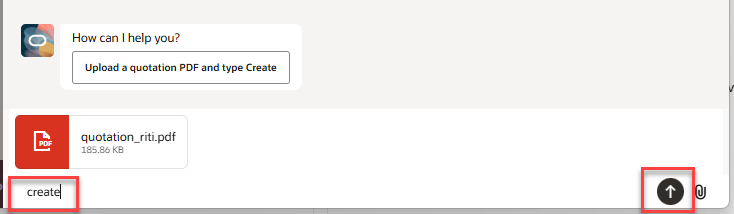
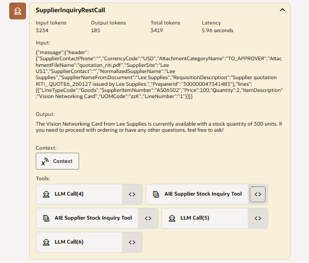
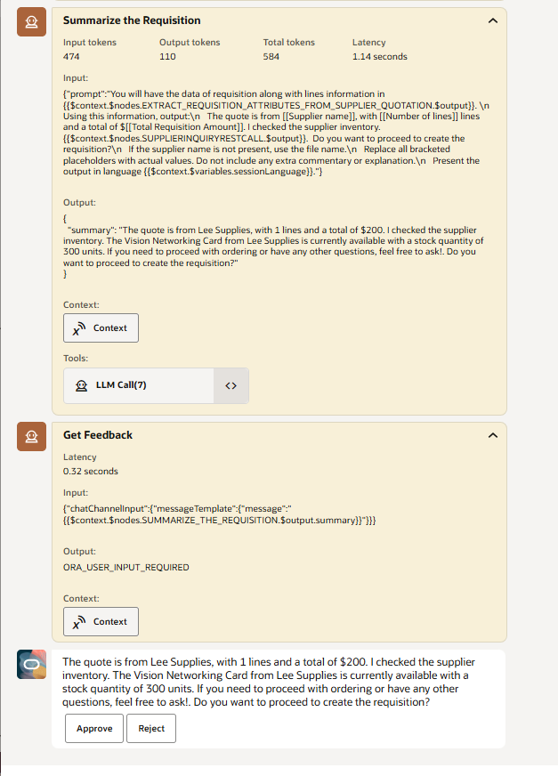
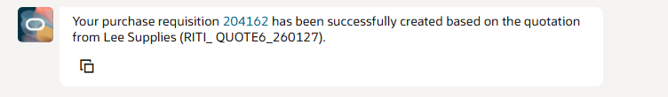
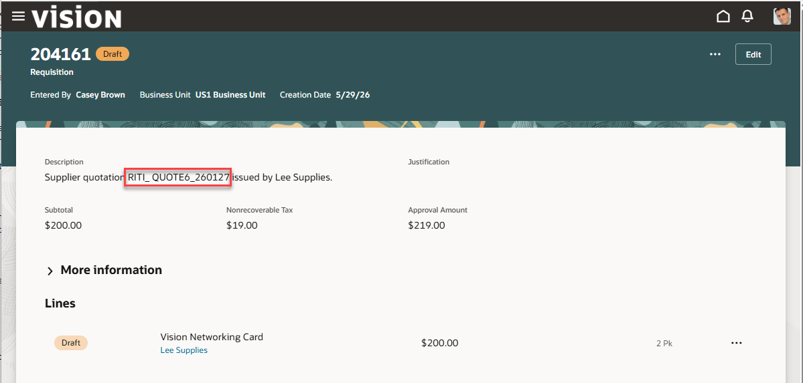

# See the Workflow in Action

## Introduction

Now that we have a completed workflow agent; you will run the agent, examine the output and get an introduction to the debugging tool in AI Agent Studio.

Estimated Time: 10 minutes

### Objectives

Understand how to run a workflow in the debugger. 
Examine the debugger output and how to drill into a step for more details.

## Task 1: Open the workflow & Run
1. Let's re-open workflow.

   Click on **Agent Teams** tab. 
   Select the **Draft** button. 
   Enter ***YOUR INITIAL CODE*** in the search box. 
   Select the pencil icon to edit your agent team:

   

2. We will now run the agent in the debugger.  Click on the run button to get things started.  
    

3. Upload the quotation Upload the .PDF file we created in the previous lab.  Click on the **paperclip** icon to upload the file. Once uploaded, type **create** in the input and press the **up arrow**.

    
   As the workflow is executing, it will call our **SupplierInquiryRestCall** step that invoked the REST tool.  The tool will take the information passed in the variable we set which contains the parsed output of our requisition as input to the REST call.  
       

4. Create the Requisition 
   You can see in the **Summarize the Requisition** step the prompt we updated is executed.  The output value from our custom agent step has been expanded to include the output from the REST call.  Notice the Approve or Reject buttons.  This is introduced by the **Get Feedback** step which required a human-in-the-loop approval to continue. 
   Click on **Approve** to continue.  
    

   The workflow creates the requisition and returns a success message.  Included in the message is a deep link that you can click on and see your requisition that was created. 
       

5.Examine the  new  requisition.  **Right click** on the hyper-link to open the requisition in a new browser tab.
    

   **Congratulations!**  You have successfully created and tested your updated workflow! 
   **You have successfully completed the Lab!**
## Summary
   You now have an understanding of how to:  
   Copy a out-of-box template. 
   Create a new custom agent that uses REST tool. 
   Extend a pre-defined workflow template with a new step & modified prompt. 
   Understand how to navigate in AI Agent Studio to accomplish the above tasks  

## Acknowledgements
* **Author** - 
* **Contributors** - 
* **Last Updated By/Date** - 